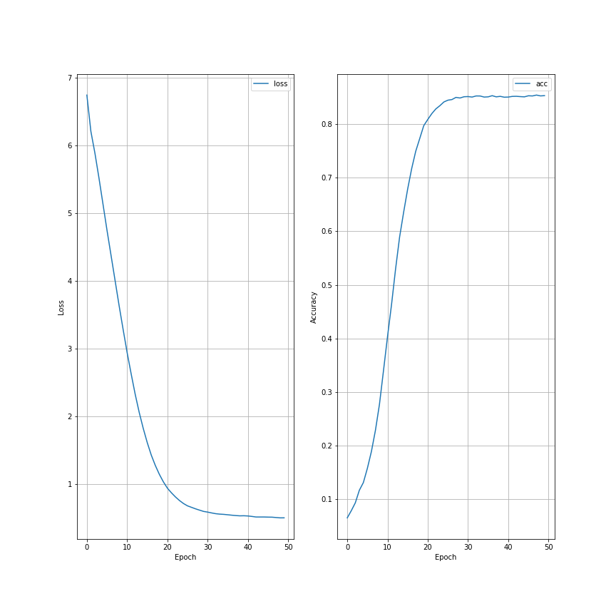

# Natural-Language-Processing-Text-Generation
This project is meant to follow along with the TensorFlow NLP tutorial for text generation. It uses simple methods to tokenizing words, applying padding, and transforming text to sequences to learn common patterns in Irish poetry. The end goal is to have a model capable of generating its own Irish poetry using seed text and the patterns extracted from the training data.

## Motivation
The motivation of this project is to practice very basic NLP techniques, and to learn about how we can tokenize words and begin extracting patterns from the english language.

## Results
### Training Results
Epoch 1/50
377/377 [==============================] - 18s 40ms/step - loss: 6.9700 - accuracy: 0.0593
Epoch 2/50
377/377 [==============================] - 13s 35ms/step - loss: 6.2117 - accuracy: 0.0773
.
.
.
Epoch 49/50
377/377 [==============================] - 13s 33ms/step - loss: 0.4641 - accuracy: 0.8610
Epoch 50/50
377/377 [==============================] - 13s 33ms/step - loss: 0.4633 - accuracy: 0.8631

### Training Graph

### Generated Poem
I made a poetry machine way for a soldier boy to the town of toome today today and toome today of gone doves gone and ones they eyes of my eyes of night unseen each wind by here and high gone and they steal your eyes are green who no more young sea more rest

## Credits

Credits to the TensorFlow youtube channel for this project idea and project tutorial. This project was accomplished following allong with what they did there. (https://youtu.be/ZMudJXhsUpY)

Credits to google apis for the dataset (https://storage.googleapis.com/laurencemoroney-blog.appspot.com/irish-lyrics-eof.txt)